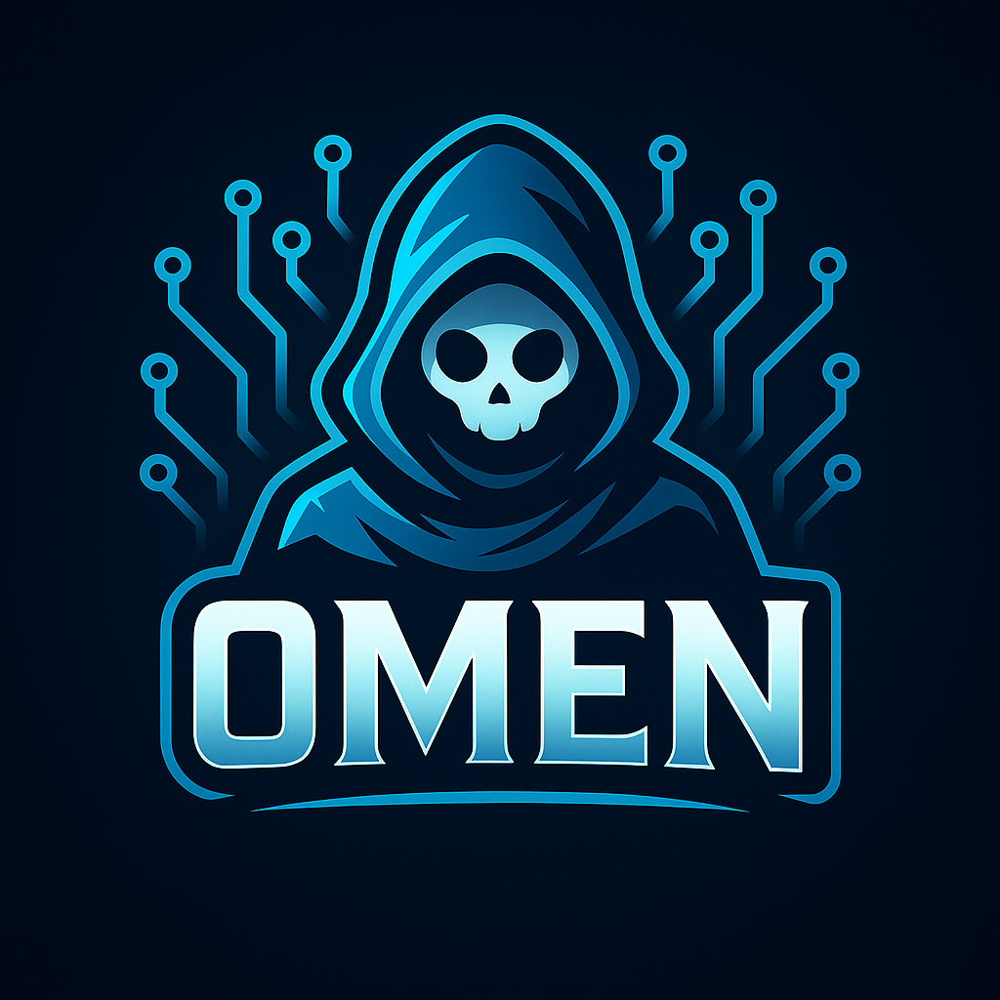

<div align="center">



# OMEN • Open Model Exchange Network

**One gateway for every model.**

[](LICENSE)
[](https://www.rust-lang.org)
[](https://docker.com)
[](https://platform.openai.com/docs/api-reference)

### 🤖 Supported AI Providers

[](https://www.anthropic.com)
[](https://openai.com)
[](https://github.com/features/copilot)
[](https://x.ai)
[](https://ai.google.dev)
[](https://ollama.ai)
[](https://azure.microsoft.com/en-us/products/ai-services/openai-service)
[](https://aws.amazon.com/bedrock)

### ✨ Key Features

[](#-routing)
[](#-vision-embeddings-files)
[](#-tools--function-calling)
[](#-auth--security)
[](#-routing)
[](#-ghost-stack-integration)

</div>

## DISCLAIMER

⚠️ **EXPERIMENTAL LIBRARY - FOR LAB/PERSONAL USE** ⚠️

This is an experimental library under active development. It is intended for research, learning, and personal projects. The API is subject to change!

---

OpenAI-compatible API + provider adapters (Claude, GPT, Grok, Gemini, Copilot*, Ollama, Bedrock, Azure) with smart routing, streaming, tool use, usage controls, and first-class hooks for GhostLLM, Zeke.nvim, Jarvis, and GhostFlow.


* Copilot note: official Copilot APIs are limited; OMEN supports Azure OpenAI as the sanctioned path for “Copilot-class” models.

## ✨ Why OMEN?

| Feature | Description |
|---------|-------------|
| 🔌 **Universal API** | Drop-in OpenAI compatibility (`/v1/*`) + extended endpoints for all providers |
| 🧠 **Smart Routing** | Intent-, cost-, and latency-aware model selection (local 4090/3070 via Ollama, or cloud) |
| 🌊 **Streaming & Tools** | WebSocket/SSE streaming, function calling, structured tool I/O |
| 📊 **Usage & Spend** | Per-user/provider quotas, rate limits, budgets, comprehensive audit logs |
| 🔐 **SSO + Keys** | Google/GitHub/Microsoft OIDC, API keys, org/workspace scoping |
| 👻 **Ghost Stack Native** | First-class adapters & hooks for GhostLLM, Zeke, Jarvis, GhostFlow |

## 🏗️ Architecture
Clients (Zeke.nvim, Jarvis, GhostFlow, CLI, browser)
          │
          ▼
       OMEN API  ──────────────────────────────────────────────┐
    (Axum, OpenAI-compat)                                      │
   ├─ Auth (OIDC/JWT/API keys)                                 │
   ├─ Router (intent + cost + quotas + latency)                │
   ├─ Providers: Anthropic | OpenAI | Azure | Grok | Gemini    │
   │             Ollama (local/remote) | Bedrock | …           │
   ├─ Tools/Functions (structured)                             │
   ├─ Usage/Spending/Rate-limit (Redis/SQLite/Postgres)        │
   └─ Audit/Event bus (NATS/Kafka optional)                    │
          │
          └── Integrations: GhostLLM · Zeke.nvim · Jarvis · GhostFlow

## 🚀 Quick Start
### 🐳 Docker Compose

```yaml
# docker-compose.yml
services:
  omen:
    image: ghcr.io/yourorg/omen:latest
    restart: unless-stopped
    environment:
      OMEN_BIND: "0.0.0.0:8080"
      OMEN_DB_URL: "sqlite:///data/omen.db" # or postgres://...
      OMEN_REDIS_URL: "redis://redis:6379"
      # SSO
      OMEN_OIDC_GOOGLE_CLIENT_ID: "..."
      OMEN_OIDC_GOOGLE_CLIENT_SECRET: "..."
      OMEN_OIDC_ALLOWED_ORIGINS: "https://ghost.cktechx.com,https://ui.omen"
      # Providers (add what you use)
      OMEN_OPENAI_API_KEY: "sk-..."
      OMEN_ANTHROPIC_API_KEY: "sk-ant-..."
      OMEN_XAI_API_KEY: "xai-..."
      OMEN_AZURE_OPENAI_ENDPOINT: "https://your-aoai.openai.azure.com/"
      OMEN_AZURE_OPENAI_API_KEY: "..."
      OMEN_GEMINI_API_KEY: "..."
      OMEN_OLLAMA_ENDPOINTS: "http://ollama.local:11434,http://ollama-3070:11434"
      # Routing
      OMEN_ROUTER_PREFER_LOCAL_FOR: "code,regex,tests"
      OMEN_BUDGET_MONTHLY_USD: "150"
    volumes:
      - ./data:/app/data
    ports:
      - "8080:8080"

  redis:
    image: redis:7-alpine
    restart: unless-stopped
```

**Run the stack:**
```bash
docker compose up -d
```

**OpenAI-compatible base URL:**
```
http(s)://<host>:8080/v1
```

## 🔌 Client Examples
### cURL

```bash
curl -s https://omen.example.com/v1/chat/completions \
  -H "Authorization: Bearer $OMEN_KEY" \
  -H "Content-Type: application/json" \
  -d '{
    "model": "auto",
    "messages": [
      {"role":"system","content":"You are a concise assistant."},
      {"role":"user","content":"Summarize the repo README in 3 bullets."}
    ],
    "stream": true
  }'

### TypeScript

```typescript
const res = await fetch(`${OMEN_URL}/v1/chat/completions`, {
  method: 'POST',
  headers: { 'Authorization': `Bearer ${OMEN_KEY}`, 'Content-Type': 'application/json' },
  body: JSON.stringify({
    model: 'auto',
    messages: [
      { role: 'system', content: 'You are Zeke in editor mode.' },
      { role: 'user', content: 'Refactor this snippet for clarity:\n' + code }
    ],
    stream: true
  })
});
```

### Rust (reqwest + tokio)

```rust
#[derive(serde::Serialize)]
struct Msg { role: String, content: String }
#[derive(serde::Serialize)]
struct Req { model: String, messages: Vec<Msg>, stream: bool }

let req = Req {
  model: "auto".into(),
  messages: vec![
    Msg{ role:"system".into(), content:"Terse assistant".into() },
    Msg{ role:"user".into(), content:"Generate unit tests for this file".into() }
  ],
  stream: true
};

let client = reqwest::Client::new();
let res = client.post(format!("{}/v1/chat/completions", omen_url))
  .bearer_auth(omen_key)
  .json(&req)
  .send().await?;
```

## 🧠 Smart Routing

OMEN chooses the best model per request:

Intent: code, reason, vision, math, tests, agent (auto-classified from messages + tags).

Cost/Quota: per-provider budgets, soft/hard caps.

Latency: prefers local Ollama (4090/3070) for short, code-like tasks.

Stickiness: sessions remain on a provider unless auto-swap is enabled.

Environment hints:

OMEN_ROUTER_PREFER_LOCAL_FOR=code,regex,tests
OMEN_ROUTER_DISABLE_PROVIDERS=gpt-3.5
OMEN_BUDGET_MONTHLY_USD=150
OMEN_SOFT_LIMIT_ANTHROPIC=70
OMEN_SOFT_LIMIT_OPENAI=70


Per-request hints:

{
  "model": "auto",
  "messages": [...],
  "tags": {"intent":"code","project":"ghostctl","priority":"low-latency"}
}

## 🛠️ Tools & Function Calling

Send tool schemas; OMEN normalizes provider specifics:

{
  "model": "auto",
  "messages": [{"role":"user","content":"Run health check on nginx."}],
  "tools": [{
    "type": "function",
    "function": {
      "name": "nginx_status",
      "description": "Check service status",
      "parameters": {
        "type":"object",
        "properties":{"verbose":{"type":"boolean"}},
        "required":[]
      }
    }
  }]
}


OMEN returns tool_calls and can forward them to Jarvis (if enabled) or back to client for execution.

## 🖼️ Vision, Embeddings, Files

Vision: pass image_url parts in messages (OpenAI style).

Embeddings: POST /v1/embeddings → routes to provider or local (Ollama/Qwen-emb).

Files: POST /v1/files storage (S3/MinIO/Local) for long prompts & retrieval.

## 🔐 Authentication & Security

SSO: Google/GitHub/Microsoft OIDC → OMEN issues signed JWTs.

API Keys: per-user/org; RBAC for models and providers.

Rate Limits: token/req limits via Redis.

Audit: request logs with provider, model, cost, latency, user.

## ⚙️ Configuration
### Example Configuration

```toml
# omen.toml
[server]
bind = "0.0.0.0:8080"

[storage]
db = "sqlite:///data/omen.db"
redis = "redis://redis:6379"

[routing]
prefer_local_for = ["code","regex","tests"]
budget_monthly_usd = 150
soft_limits = { anthropic = 70, openai = 70 }

[providers.openai]
api_key = "env:OMEN_OPENAI_API_KEY"

[providers.anthropic]
api_key = "env:OMEN_ANTHROPIC_API_KEY"

[providers.azure]
endpoint = "env:OMEN_AZURE_OPENAI_ENDPOINT"
api_key = "env:OMEN_AZURE_OPENAI_API_KEY"

[providers.xai]
api_key = "env:OMEN_XAI_API_KEY"

[providers.gemini]
api_key = "env:OMEN_GEMINI_API_KEY"

[providers.ollama]
endpoints = ["http://ollama.local:11434", "http://ollama-3070:11434"]
models = ["deepseek-coder:6.7b","llama3.1:8b-instruct","qwen2.5:7b-instruct"]
```

## 👻 Ghost Stack Integration

GhostLLM: OMEN can run as GhostLLM’s provider layer or vice-versa. Set GHOSTLLM_UPSTREAM=OMEN_URL to forward OpenAI-compat calls.

Zeke.nvim: point Neovim client to OMEN (OPENAI_API_BASE=/v1); model=auto.

Jarvis: use OMEN for reasoning; Jarvis handles system tools; OMEN coordinates tool calls.

GhostFlow: AI nodes hit OMEN; system nodes hit Jarvis; workflows orchestrate both.

## 📋 Feature Matrix

| Capability | Status |
|------------|--------|
| Chat/Completions | ✅ |
| SSE/WS Streaming | ✅ |
| Tools/Functions | ✅ |
| Vision | ✅ |
| Embeddings | ✅ |
| Files/Retrieval | ✅ |
| SSO (OIDC) | ✅ |
| API Keys | ✅ |
| Budgets/Quotas | ✅ |
| Rate Limiting | ✅ |
| Multi-Ollama | ✅ |
| Auto-Swap Models | ✅ |
| Admin Dashboard | 🔜 |
| gRPC (proto) | 🔜 |
## 🛣️ Roadmap

- [ ] **Admin UI (Yew)**: Keys management, routing weights, live usage & cost tracking
- [ ] **Provider Health**: Health probes + latency scoring for optimal routing
- [ ] **RAG Integration**: Vector database adapters for retrieval-augmented generation
- [ ] **gRPC/Proto**: SDK generation for Rust, TypeScript, Go, Python
- [ ] **Policy Engine**: "OMEN rules" for per-project caps & guardrails
- [ ] **Multi-GPU**: Advanced Ollama scheduling across 4090/3070 clusters

## 🧪 Development Setup

```bash
git clone https://github.com/ghostkellz/omen
cd omen
cp .env.example .env
cargo run --bin omen
# or
cargo build --release
```

## 📄 License

**MIT © [CK Technology](https://cktechx.com)**

---

<div align="center">

**Shaping the Future of AI Infrastructure**

[](https://github.com/ghostkellz)
[](https://www.rust-lang.org)
[](https://platform.openai.com/docs/api-reference)

</div>
